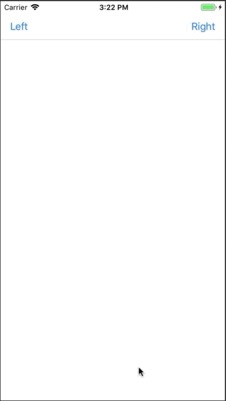

# KASideMenu

[](https://travis-ci.org/ZhihuaZhang/KASideMenu)
[](https://cocoapods.org/pods/KASideMenu)
[](https://cocoapods.org/pods/KASideMenu)
[](https://cocoapods.org/pods/KASideMenu)

KASideMenu is a simple and easy to use side menu control written in Swift.  
Check out the example project to see it in action!



## Example

See the contained example to know how `KASideMenu` can easily be integrated in your project.

Build the example from the `Example` directory.

## Requirements

- XCode 9.
- iOS 9.0+

## Installation

KASideMenu is available through [CocoaPods](https://cocoapods.org). To install
it, simply add the following line to your Podfile:

```ruby
pod 'KASideMenu'
```

## Easy to use

### Storyboards Example

1. Create a subclass of `KASideMenu`. In this example we call it `MySideMenu`.
2. In the Storyboard, add a `UIViewController` and set the root view's owner as `MySideMenu`.
3. Add more view controllers to your Storyboard, and give them `Storyboard ID` with "LeftMenuViewController", "RightMenuViewController" and "CenterViewController". 
4. Add a method `awakeFromNib` to `MySideMenu.swift` with the following code:

```swift
    override func awakeFromNib() {
        leftMenuViewController = UIStoryboard(name: "Main", bundle: nil).instantiateViewController(withIdentifier: "LeftMenuViewController")
        rightMenuViewController = UIStoryboard(name: "Main", bundle: nil).instantiateViewController(withIdentifier: "RightMenuViewController")
        centerViewController = UIStoryboard(name: "Main", bundle: nil).instantiateViewController(withIdentifier: "CenterViewController")
        
        super.awakeFromNib()
    }
```

Present the menu view controller:

```swift
sideMenu?.showLeft()
```

or

```swift
sideMenu?.showRight()
```

Close the menu controller:

```swift
sideMenu?.closeMenu()
```

## Author

ZhihuaZhang, shika.cho@kapps.co.jp

## License

KASideMenu is available under the MIT license. See the LICENSE file for more info.
